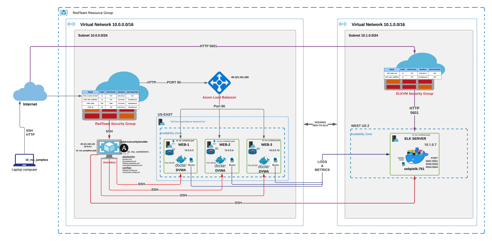

## Automated ELK Stack Deployment

The files in this repository were used to configure the network depicted below.
 



These files have been tested and used to generate a live ELK deployment on Azure. They can be used to either recreate the entire deployment pictured above. Alternatively, select portions of the ansible playbook files may be used to install only certain pieces of it, such as Filebeat.

  - _[PenTest Playbook](Ansible/pentest.yml)_
  ```yaml
  ---
  - name: Config Web VM with Docker
    hosts: webservers
    become: true
    tasks:

    - name: docker.io
      apt:
        update_cache: yes
        name: docker.io
        state: present

    - name: Install pip3
      apt:
        name: python3-pip
        state: present

    - name: Install Python Docker Module
      pip:
        name: docker
        state: present

    - name: download and launch a docker web container
      docker_container:
        name: dvw
        image: cyberxsecurity/dvwa
        state: started
        restart_policy: always
        published_ports: 80:80

    - name: enable docker at startup
      service:
        name: docker
        enabled: true

  ```
  - _[Elk Playbook](Ansible/elk.yml)_
  ```yaml
  ---
  - name: Config ELK VM with Docker
    hosts: elkservers
    become: true
    tasks:
    # Usee apt module
    - name: Install docker.io
      apt:
        update_cache: yes
        force_apt_get: yes
        name: docker.io
        state: present

    # Use apt module
    - name: Install pip3
      apt:
        force_apt_get: yes
        name: python3-pip
        state: present

    # Use pip module (It will default to pip3)
    - name: Install Python Docker Module
      pip:
        name: docker
        state: present

    # Use sysctl module
    - name: Use more memory
      sysctl:
        name: vm.max_map_count
        value: '262144'
        state: present
        reload: yes

    - name: download and launch a docker elk container
      docker_container:
        name: elk
        image: sebp/elk:761
        state: started
        restart_policy: always
        published_ports:
          - 5601:5601
          - 9200:9200
          - 5044:5044

    - name: enable docker at startup
      service:
        name: docker
        enabled: true
  ```
  - _[FileBeat Playbook](Ansible/filebeat-playbook.yml)_
  ```yaml
  ---
- name: installing and launching filebeat
  hosts: webservers
  become: yes
  tasks:

    # Use command moudle
  - name: download filebeat deb
    command: curl -L -O https://artifacts.elastic.co/downloads/beats/filebeat/filebeat-7.6.1-amd64.deb
    
    # Use command moudle
  - name: install filebeat deb
    command: dpkg -i filebeat-7.6.1-amd64.deb

    # Use copy moudle
  - name: drop in filebeat.yml
    copy:
      src: /etc/ansible/files/filebeat-config.yml
      dest: /etc/filebeat/filebeat.yml

    # Use command moudle
  - name: enable and configure system module
    command: filebeat modules enable system 

    # Use command moudle
  - name: setup filebeat
    command: filebeat setup

    # Use command moudle
  - name: start filebeat service
    command: service filebeat start

    # Use systemd module
  - name: enable service filebeat on boot
    systemd:
      name: filebeat
      enabled: yes
  ```
  - _[MetricBeat Playbook](Ansible/metricbeat-playbook.yml)_
  ```yaml
  ---
- name: Install metric beat
  hosts: webservers
  become: true
  tasks:
    # Use command moudle
  - name: Download metricbeat
    command: curl -L -O https://artifacts.elastic.co/downloads/beats/metricbeat/metricbeat-7.6.1-amd64.deb

    # Use command module
  - name: install metricbeat
    command: dpkg -i metricbeat-7.6.1-amd64.deb

    # Use copy moudle
  - name: drop in metricbeat config
    copy:
      src: /etc/ansible/files/metricbeat-config.yml
      dest: /etc/metricbeat/metricbeat.yml

    # Use command module
  - name: enable and configure docker module for metric beat
    command: metricbeat modules enable docker

    # Use command module
  - name: setup metric beat
    command: metricbeat setup

    # Use command module
  - name: start metric beat
    command: service metricbeat start

    # Use systemd module 
  - name: enable service metricbeat on boot
    systemd:
      name: metricbeat
      enabled: yes 

  ```

This document contains the following details:
- Description of the Topology
- Access Policies
- ELK Configuration
  - Beats in Use
  - Machines Being Monitored
- How to Use the Ansible Build


### Description of the Topology

The main purpose of this network is to expose a load-balanced and monitored instance of DVWA, the D*mn Vulnerable Web Application.

Load balancing ensures that the application will be highly available, in addition to restricting access to the network.

- _The Load Balancer distributes incoming internet requests to all three Web Server instances. DDoS Protection Standard is enabled on the virtual network of the Azure (internet) load balancer that has the public IP associated with it.  Jumphosts aks Bastion servers are part of the "security by obsecurity" approach, they are usually part of the infrastructure but outside of the assumed attach vector. In our example of using Web Servers, Web Servers would only accept requests via a list of specific servers, Web Servers are easily found on the internet as they expose ports and host services, like a website. The Jumpbox's only purpose is to provide access to those Web Servers, and does NOT offer any public services._

Integrating an ELK server allows users to easily monitor the vulnerable VMs for changes to the network and system logs & metrics.

- _Filebeat is a lightweight shipper for forwarding and centralizing log data. Installed as an agent on your servers, Filebeat monitors the log files or locations that you specify, collects log events, and forwards them either to ELK server for indexing._

- _Metricbeat is a lightweight shipper that you can install on your servers to periodically collect metrics from the operating system and from services/docker running on the Web Servers. Metricbeat takes the metrics and statistics that it collects and ships them to the ELK server._

The configuration details of each machine may be found below.

| Name     | Function   | IP Address | Operating System |
|----------|------------|------------|------------------|
| Jump Box | Gateway    | 10.0.0.4   | Linux            |
| Web-1    | Web Server | 10.0.0.5   | Linux            |
| Web-2    | Web Server | 10.0.0.6   | Linux            |
| Web-3    | Web Server | 10.0.0.10  | Linux            |
| ELKVM    | ELK Server | 10.1.0.7   | Linux            |

### Access Policies

The machines on the internal network are not exposed to the public Internet. 

Only the _____ machine can accept connections from the Internet. Access to this machine is only allowed from the following IP addresses:
- _TODO: Add whitelisted IP addresses_

Machines within the network can only be accessed by _____.
- _TODO: Which machine did you allow to access your ELK VM? What was its IP address?_

A summary of the access policies in place can be found in the table below.

| Name     | Publicly Accessible | Allowed IP Addresses |
|----------|---------------------|----------------------|
| Jump Box | Yes/No              | 10.0.0.1 10.0.0.2    |
|          |                     |                      |
|          |                     |                      |

### Elk Configuration

Ansible was used to automate configuration of the ELK machine. No configuration was performed manually, which is advantageous because...
- _TODO: What is the main advantage of automating configuration with Ansible?_

The playbook implements the following tasks:
- _TODO: In 3-5 bullets, explain the steps of the ELK installation play. E.g., install Docker; download image; etc._
- ...
- ...

The following screenshot displays the result of running `docker ps` after successfully configuring the ELK instance.

**Note**: The following image link needs to be updated. Replace `docker_ps_output.png` with the name of your screenshot image file.  


### Target Machines & Beats
This ELK server is configured to monitor the following machines:
- _TODO: List the IP addresses of the machines you are monitoring_

We have installed the following Beats on these machines:
- _TODO: Specify which Beats you successfully installed_

These Beats allow us to collect the following information from each machine:
- _TODO: In 1-2 sentences, explain what kind of data each beat collects, and provide 1 example of what you expect to see. E.g., `Winlogbeat` collects Windows logs, which we use to track user logon events, etc._

### Using the Playbook
In order to use the playbook, you will need to have an Ansible control node already configured. Assuming you have such a control node provisioned: 

SSH into the control node and follow the steps below:
- Copy the _____ file to _____.
- Update the _____ file to include...
- Run the playbook, and navigate to ____ to check that the installation worked as expected.

_TODO: Answer the following questions to fill in the blanks:_
- _Which file is the playbook? Where do you copy it?_
- _Which file do you update to make Ansible run the playbook on a specific machine? How do I specify which machine to install the ELK server on versus which to install Filebeat on?_
- _Which URL do you navigate to in order to check that the ELK server is running?

_As a **Bonus**, provide the specific commands the user will need to run to download the playbook, update the files, etc._