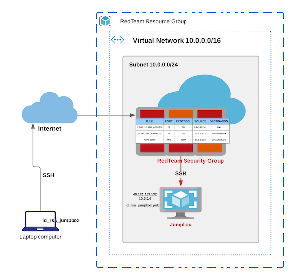

# elk-server

This template repository provides a detailed guide to build an elk infrastructure to monitor web servers on azure.

Here is how the final infrastructure would look like:

Let's start :sparkles:

### creating the infrastructure

#### terraform a jumpbox
Here is what we will have by the time we finish setting up the jumbox in this section.

#### install ansible

#### terraform instances - for web servers

#### provision web servers

#### terraform an instance - for ELK server

#### provision ELK server

#### provision fileBeats

#### provision metricBeats

